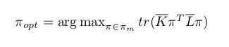
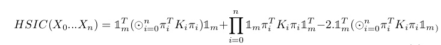
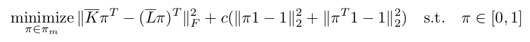

# graph_matching

## But - Ce qu'on veut faire

A partir de graphes de pits du cerveau,on cherche à établir des
 correspondances entre les pits de cerveaux de multiples patients 
(134 dans les données qu'on a). On cherche à faire un appareillage multiple mais partiel
(tous les pits n'auront pas de correspondances).

## Théorie

### Kernelized Sorting

https://papers.nips.cc/paper/3608-kernelized-sorting

Le Kernelized Sorting permet l'appariement de 2 objets (ou plus) de types 
différent n'ayant pas forcément la même structure. 
Cette méthode s'appuie sur le critère d'indépendance d'Hilbert Schmidt 
(HSIC) qui permet de mesurer la dépendance entre 2 sets de données X et Y de taille égale
 à m qui seront représenter par leur matrice noyau K et L. 
On cherche alors une matrice de permutation P qui permet de passer de K à L qui maximise ce critère.
Le problème se résume à :

Une fois la matrice P trouvée, on a P[i,j] = 1 si Y[i] correspond à X[j] 

Il existe une formule pour ce critère pour plusieurs ensembles, 
le problème pour plusieurs ensembles revient donc à maximiser :

### Convex Kernelized Sorting

http://www.dabi.temple.edu/~vucetic/documents/djuric12aaai.pdf

Le Convex Kernelized Sorting réecrit le KS en un problème équivalent, plus simple à résoudre :

Pour l'appariement de 2 objets, c'est ce problème que nous avons résolu.

### Descente du gradient 

Pour trouver des solutions aux problèmes situés plus haut, 
on utilise une descente du gradient projetée. 
Le projection met les valeurs de la matrice de permutation à 0 si ses valeurs sont négatives
. 

### Branch and bound

Le problème de le descente du gradient est qu'on peut facilement tomber sur des optima locaux 
et non sur la solution. On trouve des résultats différents selon l'initialisation...

Le branch and bound est une méthode qui nous permet de trouver une solution optimale, mais qui a le défaut 
d'être beaucoup plus longue car dans le pire des cas, on peut se retrouver à explorer l'ensemble
des permutations. Cette méthode est utilisable pour des matrices de taille 20*20 maximum.

## Implémentation

Voici comment est organiser ce dépot:

- convexminimization2.py contient les méthodes utilisées pour la descente du gradient
- convex_simple_hsic.py contient les méthodes utiles pour la création des fonctions objectif,
gradient et la descente du gradient pour l'appariement de 2 ensembles
- convex_multi_hsic.py contient les méthodes utiles pour la création des fonctions objectif,
gradient et la descente du gradient pour l'appariement de plusieurs ensembles
- matching_two_graphs.py est le programme qui charge les graphes et permet d'en choisir 2 à comparerpuis affiche les résultats sur une sphere
- multiway_matching_graph.py est le programme qui charge les graphes et permet de tous les comparer à l'aide du hsic multiple puis affiche les résultats sur une sphere
- show_results_on_sphere.py contient les méthodes utiles à la visualisation des résultats

## Requirements

- matplotlib
- trimesh
- numpy
- networkx
- pickle

